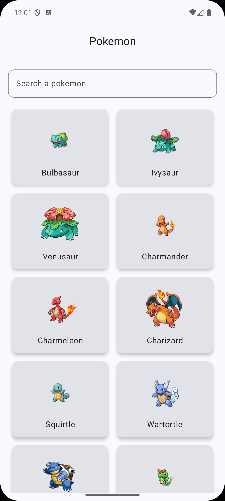
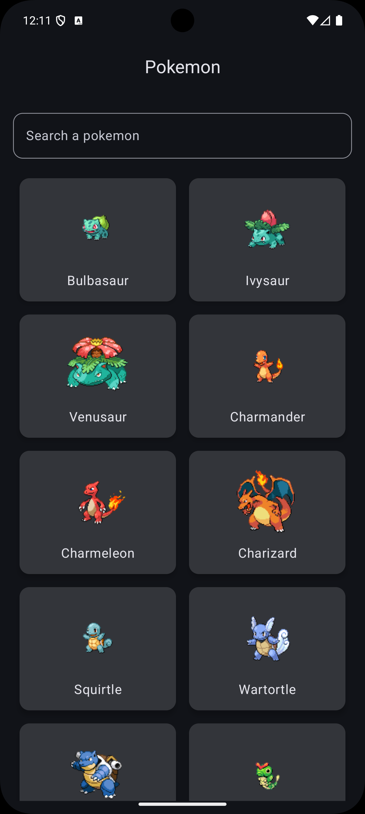
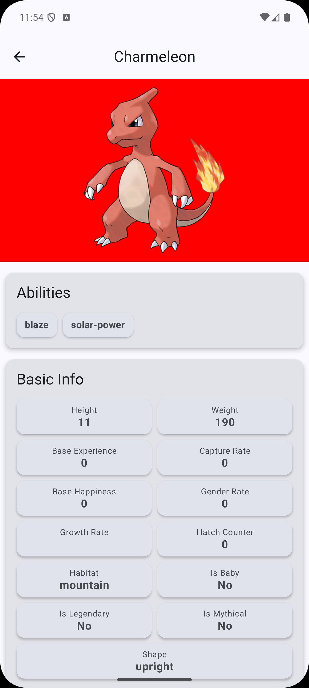
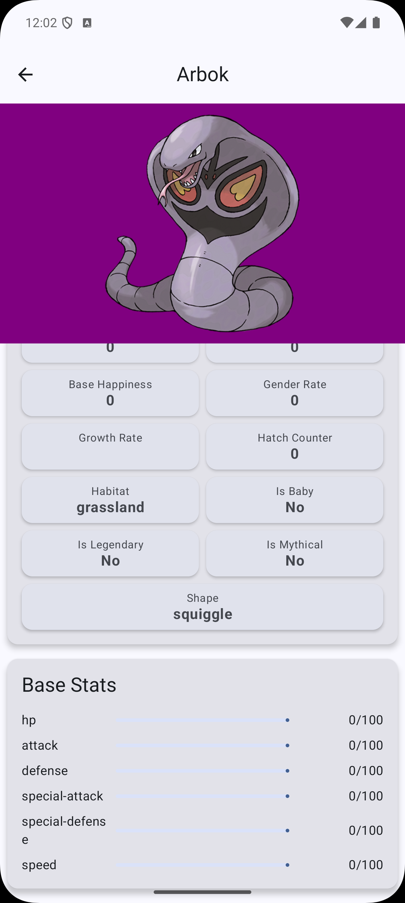
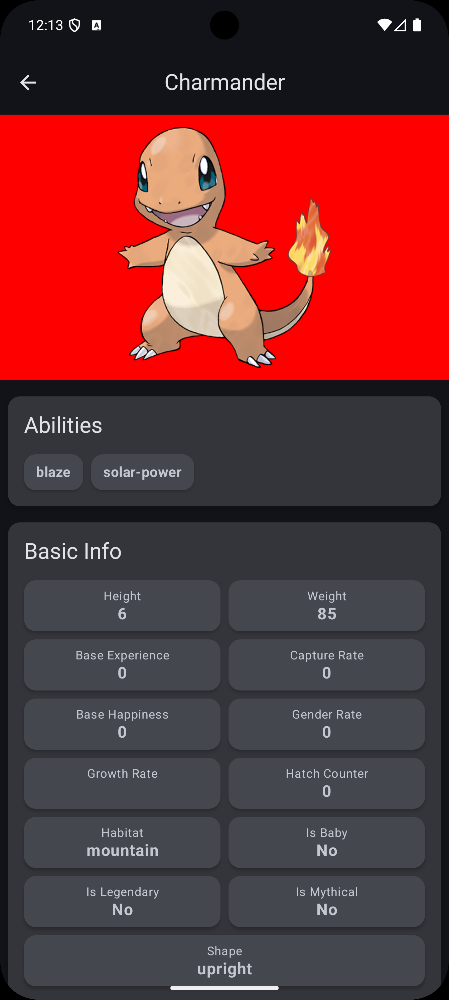
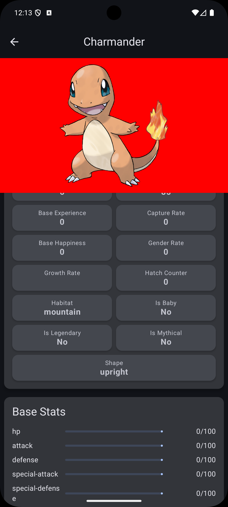
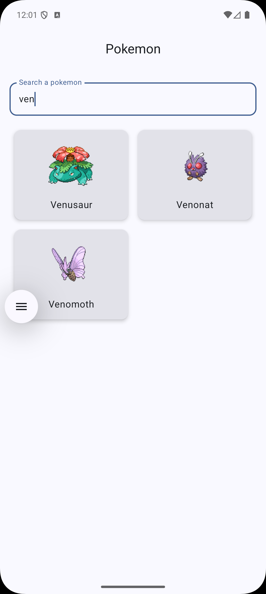
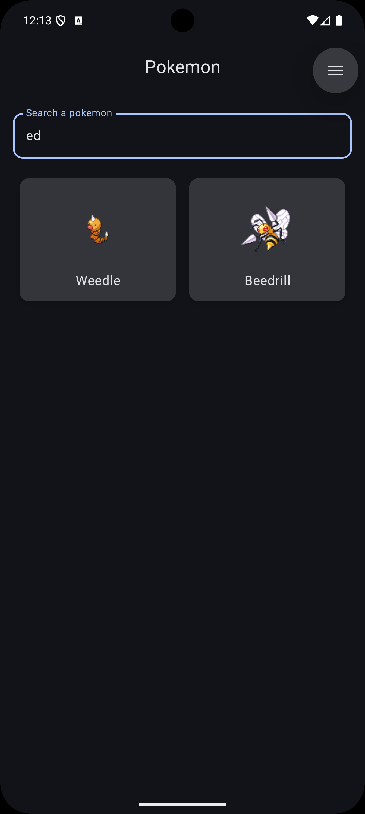
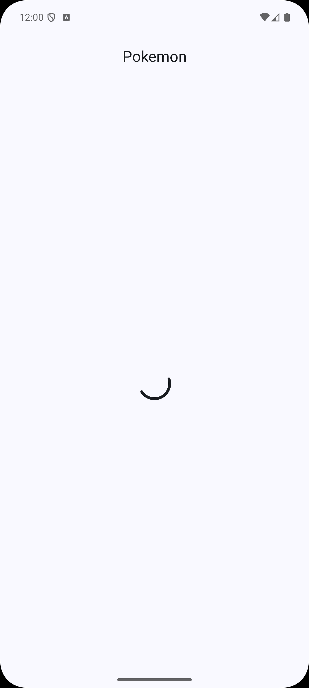

# MiniPokedex

An Android assessment to consume PokeAPI, a REST API that provides detailed data about Pokémon. This includes names, abilities, forms, stats, and more.

## 📸 Screenshots

### List Screen



### Details Screen





### Search



### Loading


## 🏗️ Architecture

The project follows a multi-module Clean Architecture pattern to promote separation of concerns, scalability, and maintainability.

### Modules

- `app`: The main application module that integrates all other modules.
- `core`: Contains shared logic and resources.
    - `:core:common`: Common utilities, models, and extensions.
    - `:core:designsystem`: Shared Compose components, themes, and design tokens.
    - `:core:network`: Networking layer setup with Retrofit, Moshi, and an abstraction for API calls.
- `feature`: Contains individual feature modules.
    - `:feature:pokedex`: The main feature of the app. It's further divided into:
        - `:data`: Implements the repositories and data sources (remote).
        - `:domain`: Contains use cases, domain models, and repository contracts.
        - `:ui`: The presentation layer with Composables, ViewModels, and UI state models.
- `build-logic`: Manages Gradle build configurations and dependencies using convention plugins for consistency across modules.

### Tech Stack

- **UI**: [Jetpack Compose](https://developer.android.com/jetpack/compose) for a declarative and modern UI.
- **Architecture**: MVVM (Model-View-ViewModel) with Clean Architecture principles.
- **Dependency Injection**: [Hilt](https://dagger.dev/hilt/) for managing dependencies.
- **Networking**: [Retrofit](https://square.github.io/retrofit/) for REST API communication and [Moshi](https://github.com/square/moshi) for JSON serialization.
- **Asynchronous Programming**: Kotlin [Coroutines](https://kotlinlang.org/docs/coroutines-overview.html) and [Flow](https://kotlinlang.org/docs/flow.html) for managing background tasks and data streams.
- **Navigation**: [Navigation Compose](https://developer.android.com/jetpack/compose/navigation) for type-safe navigation between screens.
- **Image Loading**: [Coil](https://coil-kt.github.io/coil/) for efficient image loading.

## 🚀 Getting Started

To get the project up and running, follow these steps:

1.  **Clone the repository:**
    ```bash
    git clone https://github.com/your-username/MiniPokedex.git
    ```
2.  **Open in Android Studio:**
    Open the cloned directory in the latest stable version of Android Studio.
3.  **Sync Gradle:**
    Let Android Studio sync the Gradle files and download all the required dependencies.
4.  **Run the app:**
    Select the `app` run configuration and run it on an emulator or a physical device.

## 📚 Libraries

- [Jetpack Compose](https://developer.android.com/jetpack/compose)
- [Hilt](https://dagger.dev/hilt/)
- [Retrofit](https://square.github.io/retrofit/) & [Moshi](https://github.com/square/moshi)
- [Coroutines](https://kotlinlang.org/docs/coroutines-overview.html) & [Flow](https://kotlinlang.org/docs/flow.html)
- [Navigation Compose](https://developer.android.com/jetpack/compose/navigation)
- [Coil](https://coil-kt.github.io/coil/)
- [MockK](https://mockk.io/) & [Turbine](https://github.com/cashapp/turbine) for testing.
